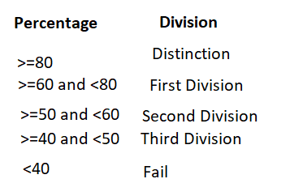
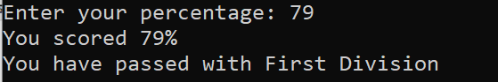
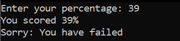

# About this Program

To write a C++ Program to check percentage of a student and display the division (distinction, first, second, third or fail) scored using switch case

# Output

<h1>Output 1</h1>

 
 

<h1>Output 2</h2>
